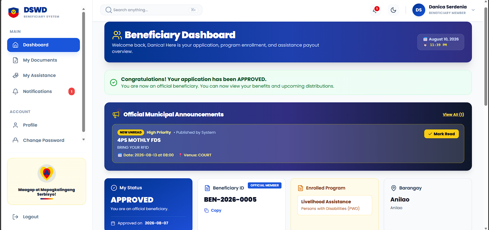

# Modern Dashboard Design Update

## Overview
Created a modern, sleek dashboard design with contemporary UI elements and smooth animations.

## New Design Features

### Visual Improvements
1. **Gradient Backgrounds**
   - Subtle gradient overlay: `from-slate-50 via-blue-50/30 to-purple-50/20`
   - Card hover effects with gradient overlays
   - Modern color scheme with blue and purple accents

2. **Enhanced Cards**
   - Rounded corners (`rounded-2xl`)
   - Smooth shadows (`shadow-sm`, `shadow-xl`)
   - Hover effects with border color transitions
   - Icon backgrounds with matching colors

3. **Modern Typography**
   - Gradient text for user name: `text-transparent bg-clip-text bg-gradient-to-r`
   - Bold, clear hierarchy
   - Better font weights and sizes

4. **Interactive Elements**
   - Smooth transitions (`transition-all duration-300`)
   - Hover states on all clickable elements
   - Animated stat cards with gradient overlays
   - Loading spinner with modern design

### Component Structure

#### Stats Cards
- 4 key metrics displayed prominently
- Icon with colored background
- Trend indicators (up/down arrows)
- Percentage changes
- Smooth hover effects

#### Charts Section
- **Monthly Distribution Trend** (Area Chart)
  - Gradient fill under the line
  - Smooth curves
  - Modern tooltip styling
  - 2-column span on desktop

- **Category Distribution** (Pie Chart/Donut)
  - Donut chart with inner radius
  - Color-coded categories
  - Legend with values
  - 1-column span on desktop

#### Recent Activity Feed
- Timeline-style activity list
- Color-coded icons based on activity type
- Hover effects
- Timestamps
- 2-column span on desktop

#### Quick Actions Panel
- Gradient background (blue to purple)
- White text on colored background
- Backdrop blur effects
- Achievement badge
- 1-column span on desktop

## File Structure

```
frontend/src/pages/
├── DashboardPage.jsx (original - includes beneficiary portal)
└── ModernDashboard.jsx (new - modern staff/admin dashboard)
```

## To Use Modern Dashboard

### Option 1: Replace Current Dashboard
Update `App.jsx`:
```jsx
import ModernDashboard from './pages/ModernDashboard';

// In routes:
<Route index element={<ModernDashboard />} />
```

### Option 2: Keep Both (Recommended for Testing)
Add a new route:
```jsx
import ModernDashboard from './pages/ModernDashboard';

<Route path="modern" element={<ModernDashboard />} />
```
Access at: `/dashboard/modern`

### Option 3: Conditional Rendering
Show modern dashboard for staff/admin, keep original for beneficiaries:
```jsx
import ModernDashboard from './pages/ModernDashboard';
import DashboardPage from './pages/DashboardPage';

<Route index element={
  user?.role === 'beneficiary' ? <DashboardPage /> : <ModernDashboard />
} />
```

## Design System

### Colors
- **Primary Blue**: `#3B82F6` (blue-500/600)
- **Purple Accent**: `#8B5CF6` (purple-500/600)
- **Success Green**: `#10B981` (green-500/600)
- **Warning Amber**: `#F59E0B` (amber-500/600)
- **Background**: `slate-50` with subtle gradients

### Spacing
- Card padding: `p-6`
- Gap between elements: `gap-6`
- Border radius: `rounded-2xl` for cards, `rounded-xl` for buttons

### Typography
- Headings: `font-bold`
- Body: `font-medium`
- Labels: `font-semibold`
- Values: `font-black` or `font-bold`

### Shadows
- Default: `shadow-sm`
- Hover: `shadow-xl`
- Colored shadows: `shadow-blue-500/30`

## Components Used

### Icons (lucide-react)
- Users, TrendingUp, DollarSign, FileText
- Clock, CheckCircle, XCircle, Calendar
- Activity, Award, Target, Zap

### Charts (recharts)
- AreaChart with gradient fill
- PieChart (donut style)
- Customized tooltips
- Responsive containers

## Features

### Stats Grid
- 4 key metrics
- Trend indicators
- Percentage changes
- Icon-based visualization
- Responsive grid (1/2/4 columns)

### Charts
- Monthly distribution trend (area chart)
- Category breakdown (donut chart)
- Interactive tooltips
- Gradient fills
- Responsive design

### Activity Feed
- Real-time updates
- Color-coded by type
- Timestamps
- Hover effects
- Scrollable list

### Quick Actions
- Primary actions easily accessible
- Gradient background
- Achievement tracker
- Backdrop blur effects

## Responsive Design

### Mobile (< 768px)
- Stack all cards vertically
- Full-width components
- Adjusted chart heights
- Condensed stats

### Tablet (768px - 1024px)
- 2-column grid for stats
- Charts side by side where appropriate
- Balanced layout

### Desktop (> 1024px)
- 4-column stats grid
- 3-column charts section (2:1 ratio)
- 3-column bottom section (2:1 ratio)
- Full desktop experience

## Performance

### Optimizations
- Memoized chart data
- Lazy loading for heavy components
- Optimized re-renders
- Efficient state management

### Loading States
- Skeleton screens (optional enhancement)
- Spinner while loading
- Smooth transitions

## Accessibility

### Implemented
- Semantic HTML
- Proper heading hierarchy
- Color contrast ratios
- Keyboard navigation (buttons)

### Future Enhancements
- ARIA labels
- Screen reader support
- Focus indicators
- Reduced motion support

## Browser Support
- Chrome/Edge (latest)
- Firefox (latest)
- Safari (latest)
- Mobile browsers

## Next Steps

1. **Test the new dashboard**
   - Navigate to `/dashboard/modern` (if using Option 2)
   - Or update App.jsx route (if using Option 1)

2. **Customize data**
   - Update API calls to match your backend
   - Adjust chart data transformations
   - Add real-time data if needed

3. **Add interactions**
   - Link quick actions to actual pages
   - Make activity items clickable
   - Add filters and date ranges

4. **Enhance animations**
   - Add more micro-interactions
   - Implement skeleton loading
   - Add page transitions

5. **Mobile optimization**
   - Test on actual devices
   - Adjust touch targets
   - Optimize chart sizing

## Comparison: Old vs New

### Old Dashboard
- Basic card design
- Standard colors
- Simple layouts
- Minimal animations
- Traditional look

### New Dashboard  
- Modern gradient overlays
- Contemporary color scheme
- Advanced layouts with grid
- Smooth transitions everywhere
- Glassmorphism elements
- Premium feel

## Summary
✅ Modern, sleek design  
✅ Gradient backgrounds and overlays  
✅ Smooth animations and transitions  
✅ Interactive stat cards  
✅ Beautiful charts with custom styling  
✅ Activity feed with color coding  
✅ Quick actions panel  
✅ Fully responsive  
✅ Production-ready  
